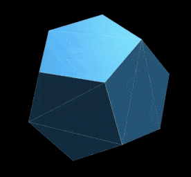

<!-- <head>
    <meta charset=utf-8>
    <title> Draw a Dodecahedron in 12 simple steps!</title>
    <meta name="viewport" content="width=device-width, initial-scale=1.0">
    <link rel="canonical" href="http:">
    <link href="https://raw.githubusercontent.com/mrcoles/markdown-css/master/markdown.css" rel="stylesheet">
</head> -->

[todo](todo.md)


# Draw a Dodecahedron in 12 simple steps

<!-- Motivation -->

Understand the basic concept of 3D graphics, how it renders on 2D surface, such as screen, film, or canvas, or your retina

![0][0]

[0]: https://cdn-images-1.medium.com/max/1600/1*vfDeX9HH5TGwY2cgyBuuFA.png

<!-- What? and why? -->

## What is a Dodecahedron?

A geometry with:

- 20 points .
- 30 edges -
- 12 faces *

- each point neighbors 3 edges and 3 faces
- each edge neighbors 2 points and 2 faces
- each face neighbors of 5 points, 5 edges and 5 faces

<!--
pef
033 p
202 e
555 f
 -->

<!-- 
[5555](https://i.pinimg.com/originals/95/b1/1e/95b11ea87fb2b9012d834e3f30cc803a.jpg) 
-->

---

# Why Dodecahedron?

<!-- It’s a fascinating shape, -->

**Regular Tiling** is covering a shape using Identical Regular Polygons only.

Tiling a plane in 2D is possible with:

- triangles (3)
- squares (4)
- and hexagons (6)

![Tiling][1]

[1]: https://photos-3.dropbox.com/t/2/AADVaOMyzJnh-SLZCaJvDfz2mFpqAmIQjjto56WFRfrvJw/12/3685114/png/32x32/1/_/1/2/Screenshot%202018-05-15%2001.08.41.png/EKra4wIYxIsKIAIoAg/psyHSAC1LpsrvxCz1No8XFJYVNUjqW7PXXM8sc_EfG0?preserve_transparency=1&size=2048x1536&size_mode=3

Tiling a sphere in 3D is possible with:

- triangles
  - Tetrahedron (4), "Pyramid"
  - Octahedron (8), "Double pyramid"
  - Icosahedron (20),

- squares
  - Hexahedron (6), "Cube"

- and pentagons
  - Dodecahedron (12)

![2][2]

## Platonic Solids
> In three-dimensional space, a Platonic solid is a regular, convex polyhedron. It is constructed by congruent (identical in shape and size) regular (all angles equal and all sides equal) polygonal faces with the same number of faces meeting at each vertex. Five solids meet those criteria: Tetra-, Hexa-, Octa-, Dodeca-, Icosa-hedron 


[2]: https://photos-4.dropbox.com/t/2/AACAkHR_Am3tST2lfT-Y_I4dQb_Q8J_HKCGEIs98lcu1fA/12/3685114/png/32x32/1/_/1/2/Screenshot%202018-05-15%2004.28.55.png/EKra4wIYxYsKIAIoAg/Wh89MTVoJkMCF13P3dCxsEyxEe0dYvzosOZ6CRwPxxU?preserve_transparency=1&size=2048x1536&size_mode=3

# Let’s Draw!

Set up the scene:

- Take a pen or a pencil and a piece of paper or a notebook; 
  - post-its are great for sketching quickly

- Draw a pentagon
  - Pick a center point, draw a circle around it, divide to five

- Extend each point outwards. 
  - about half the length of the inner pentagon

- Draw a point on an imaginary arc between each two points
  - Connect each new point to its two neighbors

- Pull a line towards the center
  - Same as before, the point is on an arc between each two points in the inner pentagon

- Connect those points into a pentagon

# You made it! 

- Frame it and put it on the fridge

Draw twelve more, some options:

- Add shading, color
  - draw pattern aligned with edges
  - crisscross for heavy shade `-+*#`

- Thicken thin lines or points 
  - perspective

- Hide occluded points
  - make only some faces transparent

- Rotate
- Duplicate

## That's it! 

Thank You!

## Introspection - what have we done?

> on the remaining 7 slides we can dig in theory, and code a bit.

Drawing can be analyzed as an iterative process that involves:
- creating an image from a model, in our case - an abstract mathematical shape
- adding light and shading to the image
- looking at the drawing, estimating how ‘real’ it looks 
- repeat

these actions can be mapped to the pillars of 3D processing:
- Computer Graphics - creating an image from a model
- Image Processing - converting one image to another
- Computer Vision - understanding an image, reconstructing model

<!-- In broad strokes (heh)  -->
> Word > Image > Image > Word

<!-- END THEORY -->

# Let's Code!

<!-- Since we mentioned 3D graphics,  -->

To put our things in the context digital world, we use Three.js, Javascript 3D Library

Each of the objects that we used in the Scene:

- geometry - dodecahedron
- camera - paper and eyes
- material - shading
- light - light
<!-- gee, camel -->

are objects in Three.js

# THREE.js

It's so good I can't even

## Scene
Scenes allow you to set up what and where is to be rendered by three.js. 
This is where you place objects, cameras and lights.

<!-- show basic scene -->

# Geometry

- Platonic solids (Pyramid, cube, octa-, dodeca- icosa-, 
- Sphere
- Circle, pipe, bone, parametric, etc.

<!-- add dodecahedron -->

---

# Camera

<!-- Projection, 3x4 matrix  -->

<!-- Camera that uses perspective projection. -->
## Perspective Camera
- object's size is shrinks with its distance from the camera
- This is the way the human eye sees
- used for rendering a realistic 3D scene

<!-- Camera that uses orthographic projection. -->
## OrthographicCamera
- object's size in the rendered image stays constant regardless of its distance from the camera.
- z data is simply discarded 
- useful for rendering 2D scenes and UI elements

![][ortho]

[ortho]: http://glumpy.readthedocs.io/en/latest/_images/projection.png

<!-- change to ortho camera -->

---

# Material
Materials have intrinsic attributes:
- Color
- Transparency, Reflectance
- Emission

On on the Surface:
- Shade - how much light hits the face ...
- Diffusion - ... in which angle ...
- Specular Reflection - ... relative to viewer

<!-- change to Lambertian/Phong -->
<!-- [Material docs](https://threejs.org/docs/#api/materials/Material) -->

# Light

has Intensity, and Color

## Point Light
Simplest model, light that gets emitted from a single point in all directions

- Spot - group of point light, in a sphere or circle shape 
- Ambient - constant light everywhere in the scene
- Directional
- Hemisphere - natural

<!-- Place light above frame, to either side (break symmetry) -->

# Material & Light 

Each object responds to light based on its (internal) attributes and position in the scene (external), there several shading algorithms to compute the color in each point.

## Shading algorithms
- Basic - flat Color and Intensity, not responding to light. (not realistic)
- Lambertian (L dot N)
<!-- - Gouraud slightly old model  :b -->
- Phong - shiny surfaces with specular highlights (the Normal splits the angle between light, face and viewer)

> “...a surface reflects light as a combination of the diffuse reflection of rough surfaces with the specular reflection of shiny surfaces”, _Dr. Phong_

- Raytracing

## Shaders

- Vertex shader - changes position of vertex, Geometry
- Fragment shader - changes face color, Material

# Techniques

Perspective - twice as far - twice as small
Perspective - an object with radius 1 standing 4 meters away (far=4+1, near=4-1, ratio = 3/5)
Perspective - Closer points are bigger `...oo88OOO@@@` and edges are thicker `-=#M`

Shading - draw 32 shades from white to black
Shading - crisscross patterns, along the face (like jeans)
Shading - edges aren’t visible in realistic scene, create changes in shading towards edges. great with letters

<!-- # AR Demo -->
